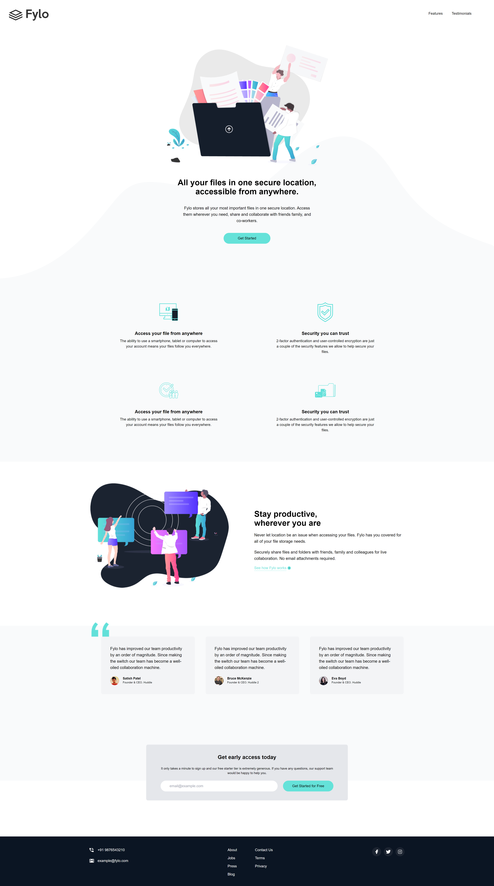

# fyloTraining

This README provides an overview of the `index.html` file for the fyloTraining project, focusing on the Tailwind CSS classes and functionality used throughout the document. The file is structured into several key sections, each utilizing various Tailwind utilities to create a responsive and visually appealing layout.

## Table of Contents
1. [Hero Section](#hero-section)
2. [Features Section](#features-section)
3. [Productivity Section](#productivity-section)
4. [Testimonials Section](#testimonials-section)
5. [Early Access Section](#early-access-section)
6. [Footer Section](#footer-section)

## Hero Section

The hero section serves as the introduction to the page, featuring a welcoming message and a call-to-action.

### Key Tailwind Classes:
- **Container**: `container mx-auto px-6 text-center` - Centers the content and applies padding.
- **Text Styling**: `text-3xl font-bold` - Sets a large, bold font for emphasis.
- **Button Styles**: `bg-accentCyan hover:scale-95` - Styles the button with color and a hover effect for interaction.

## Features Section

This section highlights the key features of the product with supporting text and icons.

### Key Tailwind Classes:
- **Flex Layout**: `flex flex-col md:flex-row` - Adjusts the layout based on screen size, allowing for a responsive design.
- **Text Centering**: `text-center` - Centers the text within each feature item.
- **Background Color**: `bg-gray-50` - Applies a light gray background to enhance readability.

## Productivity Section

The productivity section emphasizes the ease of access to files from any location.

### Key Tailwind Classes:
- **Flex Utilities**: `flex flex-col md:flex-row` - Arranges the content in a flexible layout.
- **Text Styling**: `text-xl font-bold` - Highlights the main heading.
- **Image Sizing**: `mb-10` - Adds margin below the image for spacing.

## Testimonials Section

The testimonials section features user feedback to build trust and credibility.

### Key Tailwind Classes:
- **Flex Layout**: `flex flex-col md:flex-row` - Displays testimonials in a row on larger screens.
- **Background Color**: `bg-gray-100` - Sets a light background for readability.
- **Rounded Corners**: `rounded-lg` - Applies rounded corners to the testimonial boxes for a modern look.

## Early Access Section

The early access section encourages users to sign up for early access to the service.

### Key Tailwind Classes:
- **Text Centering**: `text-center` - Centers the text and inputs.
- **Background Color**: `bg-gray-200` - Applies a light background color.
- **Flex Utilities**: `flex flex-col md:flex-row` - Organizes the input and button in a responsive layout.

## Footer Section

The footer concludes the page with additional navigation and contact information.

### Key Tailwind Classes:
- **Background Color**: `bg-darkBlue2` - Sets the footer background color for contrast.
- **Flex Utilities**: `flex justify-between` - Arranges footer content horizontally and aligns it properly.
- **Text Color**: `text-white` - Applies a white color to footer text for readability.
